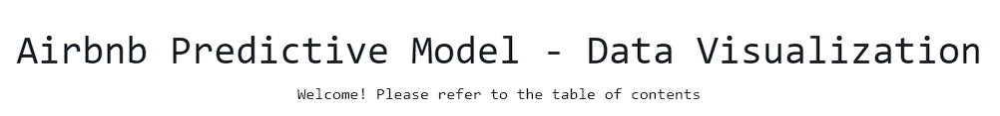

<div align="center">
  

### [rio-airbnb.up.railway.app](https://rio-airbnb.up.railway.app)
</div>


This a web portal created to serve this RIO Airbnb Predictive Model research project at Cal Poly Pomona. For more information on the project, chec, 

either to showcase exploratory data analysis, model results, or as interactive demos of the model itself.


## Sections Summary
### Literature Analysis
* This section is designed to showcase results of our analysis of related literature, including various papers about Airbnb price predicting models and sentiment analysis techniques.
* Include four sections: **Overview**, **Features**, **Models**, and **Other**

### Dataset (in progress)
* This section is designed to showcase the results of our exploratory data analysis of the dataset of Airbnb listings.


## Run the Web Portal
* It is advised to run the development server in a virtual environment. To set up an virtual environment, download `virtualenv` and create a virtual environment:
```bash
pip install virtualenv
virtual env
```
* Activate the virtual environment by entering:
```python
source env/scripts/activate   # If you're using Git Bash
./env/scripts/activate.ps1    # If you're using Command Prompt / PowerShell
```
* Download all required dependencies by typing `pip install -r requirements.txt`


* Finally, run the `main.py` file in the root directory:
```bash
python main.py
```
* After the commands run, this prompt should appear:
```
Dash is running on http://127.0.0.1:8050/

 * Serving Flask app 'app'
 * Debug mode: on
```
* Navigate to the given URL address on your browser to access the web portal


## Technnologies 
* Python
* Flask
* Plotly 
* Pandas